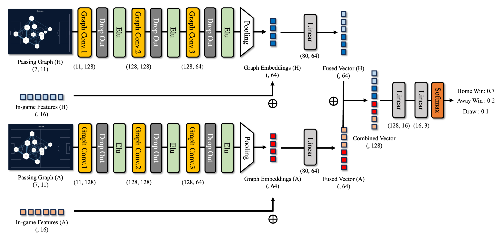

# We-Know-Who-Win

This repository contains the Pytorch implementation code for the paper "We Know Who Wins: Graph-oriented Approaches of Passing Networks for Predictive Football Match Outcomes"

## Architectures



Both the passing graph and in-game features of each team are input to the model. The passing graph passes through three convolution blocks consisting of graph convolution-dropout-elu layer to be pooled into graph embedding. The graph embeddings of both teams that have been fused with the in-game features are combined again to finally return the probability for each class.

## Dependencies

Please refer to [requirements.txt](requirements.txt) for package dependency to reproduce the code in this repository.

## Data

The data used in this study is from England's 1st division professional football league (Premier League) and 2nd division professional football league (Championship League) for the 20/21, 21/22, and 22/23 seasons, and consists of a total of 2835 games. All data was crawled from [Whoscored.com](https://1xbet.whoscored.com/), and the raw data is the HTML file of the web page for each match. The HTML files are shared through the link below due to size issues.

[Filelink](https://drive.google.com/drive/folders/1w2XSlFA7iWhVxeO2IGEC8JGbf-X7YHNc?usp=drive_link)

## Usage

You can run every steps from preprocessing the raw html data to testing new example through the following commands.

1. Preprocessing

This step takes raw html files as input and returns preprocessed `torch_geometric.Data`-type json file. The `prediction Minute` refers to the time period you want to make passing network to predict the outcome of the match.

```python
python3 preprocess.py --gpu_num [YOUR GPU NUM] --pred_min [Prediction Minute]
```

2. Training

This step takes two json files (Home Data and Away Data) and trains the proposed model in our study. You can run this step through the following command.

```python
python3 training.py --gpu_num [YOUR GPU NUM]
```

The hyperparameters needed to train the model will be set as default unless you designate them by parsers.

```python
python3 training.py --gpu_num [YOUR GPU NUM] --n_epochs 1000 --e_patience 50 --lr 0.001 --pred_min 90
```

3. Testing

With the trained model, you can test the model performance. Here, there are two options you can take depending on whether you want to test the model using the testloaders of the original dataset we provide in this repository or to test the model with the whole new match data.

For the former, you can do it through the following command

```python
python3 testing.py --use_testloader yes --new_scaler no --gpu_num [YOUR GPU NUM]
```python

Then you should provide the directory of the saved testloaders and scalers. These will be automatically saved in your `Training` folder after you run the training step.

For the latter, you can do it through the following command

```python
python3 testing.py --use_testloader no --new_scaler no --gpu_num [YOUR GPU NUM]
```python

Here, the `--new_scaler` parser is [no] when you want to test a single match, or [yes] when you want to test more than one matches.
